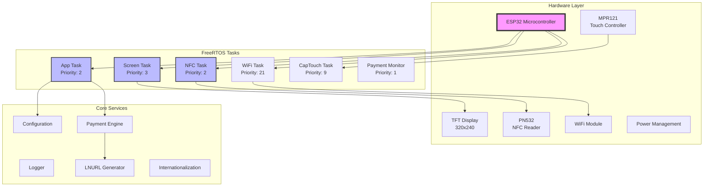
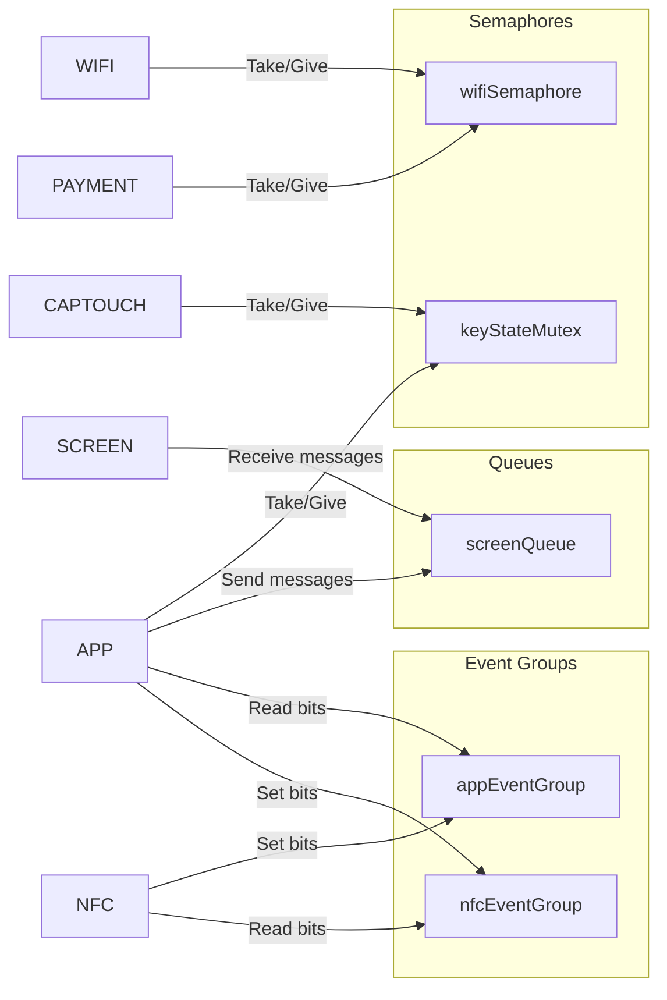
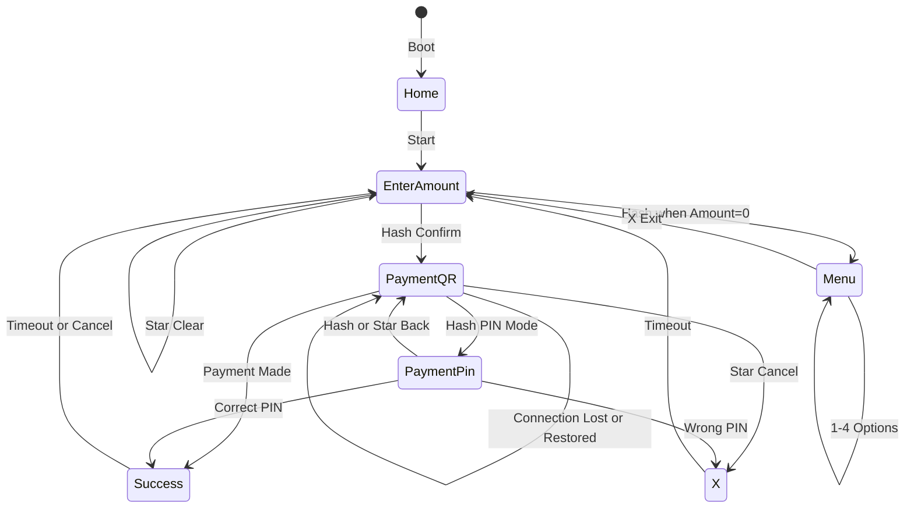
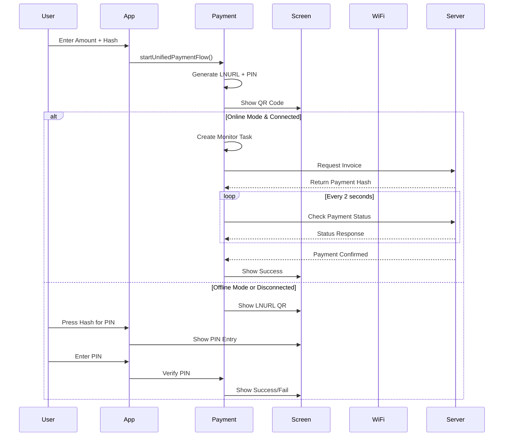
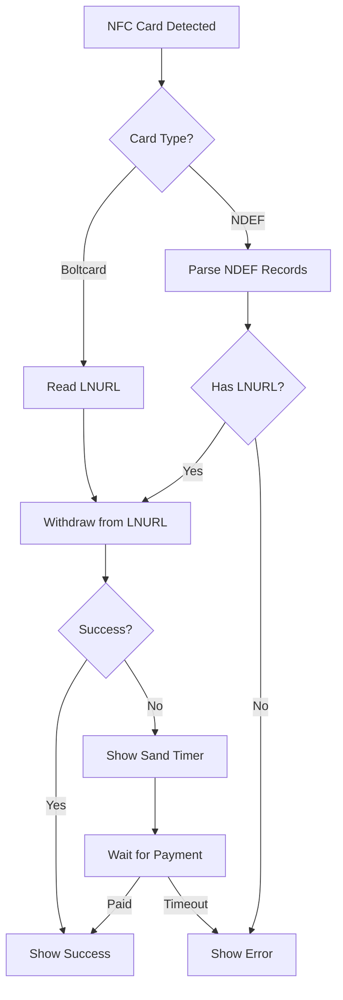

# OPAGO-POS Documentation

## Table of Contents
1. [Project Overview](#project-overview)
2. [Architecture Overview](#architecture-overview)
3. [Task Architecture](#task-architecture)
4. [State Machine Flows](#state-machine-flows)
5. [Component Descriptions](#component-descriptions)
6. [Hardware Interfaces](#hardware-interfaces)
7. [Communication Protocols](#communication-protocols)
8. [Configuration System](#configuration-system)
9. [Payment Flow](#payment-flow)
10. [API Integration](#api-integration)

## Project Overview

OPAGO-POS is a Lightning Network Point-of-Sale terminal based on ESP32, designed for both online and offline Bitcoin Lightning payments. The system supports:

- **Unified Payment Flow (v3.0.0)**: Both online and offline modes use the same LNURL QR code
- **PIN Fallback**: When connection is lost or in offline mode, users can verify payments with a PIN
- **NFC Support**: Read boltcards and LNURL withdraw cards
- **Capacitive Touch Keypad**: 12-key input system
- **TFT Display**: 320x240 color display with adjustable contrast
- **WiFi Connectivity**: Automatic connection management with fallback
- **Power Management**: Battery operation with charging indication

## Architecture Overview



## Task Architecture

The system uses FreeRTOS for task management with the following task structure:

### Task Overview

| Task | Priority | Stack Size | Purpose |
|------|----------|------------|---------|
| WiFi Task | 21 | 4096 | Manages WiFi connection and reconnection |
| CapTouch Task | 9 | 4096 | Monitors capacitive touch input with debouncing |
| Screen Task | 3 | 8192 | Handles all screen updates via message queue |
| App Task | 2 | 8000 | Main application logic and state management |
| NFC Task | 2 | 8000 | NFC card reading and processing |
| Payment Monitor | 1 | 8192 | Background online payment status monitoring |

### Inter-Task Communication



### Event Group Bit Definitions

**nfcEventGroup:**
- Bit 0 (1 << 0): Instructs NFC task to power up or remain active
- Bit 1 (1 << 1): Commands NFC task to turn off RF and enter idle mode

**appEventGroup:**
- Bit 0 (1 << 0): Indicates NFC task is actively processing
- Bit 1 (1 << 1): Confirms successful RF shutdown and idle mode transition

## State Machine Flows

### Main Application State Machine



### Payment Flow State Machine (v3.0.0)



## Component Descriptions

### Core Components

#### 1. **App Task** (`lib/app/app.cpp`)
- Main application logic controller
- Handles user input from touch keypad
- Manages screen transitions
- Coordinates payment flow
- Implements sleep mode logic

#### 2. **Screen System** (`lib/screen/`)
- **screen.cpp**: Task-based screen management with message queue
- **screen_tft.cpp**: Low-level TFT rendering functions
- Supports multiple screen types (Home, Amount, QR, PIN, Success, etc.)
- Non-blocking screen updates via queue

#### 3. **Payment Engine** (`lib/payment/payment.cpp`)
- Unified payment flow implementation
- LNURL generation and encoding
- Online payment monitoring
- PIN verification fallback
- Connection loss handling

#### 4. **NFC System** (`lib/nfc/nfc.cpp`)
- PN532 NFC reader interface
- Boltcard reading
- LNURL withdraw support
- NDEF message parsing
- Power management (RF on/off)

#### 5. **Touch Input** (`lib/cap_touch/cap_touch.cpp`)
- MPR121 capacitive touch controller
- 12-key keypad (0-9, star, hash)
- Adjustable sensitivity
- Long press detection
- Debouncing logic

#### 6. **WiFi Management** (`lib/opago_wifi/opago_wifi.cpp`)
- Automatic connection management
- Network scanning and selection
- Event-based status updates
- Semaphore-protected access

### Utility Libraries

#### 1. **Configuration** (`lib/config/`)
- Persistent storage in SPIFFS
- JSON-based configuration
- Runtime parameter updates
- Default value management

#### 2. **Logger** (`lib/logger/`)
- Multi-level logging (debug, info, warning, error)
- SPIFFS-based log storage
- Serial output support
- Log rotation

#### 3. **LNURL** (`lib/lnurl/`)
- Bech32 encoding/decoding
- XOR encryption for offline payments
- URL-safe base64 encoding
- HMAC-SHA256 signatures

#### 4. **Internationalization** (`lib/i18n/`)
- Multi-language support
- Runtime language switching
- String translation tables

## Hardware Interfaces

### Pin Configuration

```c
// Touch Controller (MPR121)
#define MPR_SDA   32
#define MPR_SCL   33
#define MPR_IRQ   35

// NFC Reader (PN532)
#define NFC_SDA   13
#define NFC_SCL   15
#define NFC_IRQ   26
#define NFC_RST   25

// TFT Display (via SPI)
// Configured in User_Setup.h of TFT_eSPI library
```

### I2C Buses
- **Wire**: NFC communication (400kHz)
- **Wire1**: Touch controller communication

### Power Management
- USB power detection
- Battery level monitoring
- Charging status indication
- Sleep mode support (screen off)

## Communication Protocols

### LNURL Protocol

The system implements LNURL-pay for Lightning payments:

1. **URL Generation**: `https://server/lnurlpay?p=<encrypted_payload>`
2. **Payload Structure**: XOR-encrypted containing amount and PIN
3. **Encoding**: Bech32 with "lnurl" HRP

### API Endpoints

#### Payment Creation
```
POST /api/v1/payments
Content-Type: application/json
X-Api-Key: <api_key>

{
  "out": false,
  "amount": <amount_in_sats>,
  "memo": "Payment description"
}
```

#### Payment Status Check
```
GET /api/v1/payments/<payment_hash>
X-Api-Key: <api_key>

Response:
{
  "paid": true/false,
  "details": {...}
}
```

## Configuration System

### Key Configuration Parameters

```json
{
  "fiatCurrency": "EUR",
  "fiatPrecision": 2,
  "callbackUrl": "https://your-server.com/lnurlpay",
  "apiKey": {
    "key": "your-api-key",
    "encoding": "hex"
  },
  "nfcEnabled": true,
  "offlineMode": false,
  "contrastLevel": 100,
  "touchSensitivity": 50,
  "language": "en",
  "sleepModeDelay": 600000,
  "uriSchemaPrefix": "lightning:",
  "tftRotation": 3
}
```

### Runtime Configuration

Configuration can be updated via:
1. JSON-RPC commands over serial
2. Menu system on device
3. Web interface (if enabled)

## Payment Flow

### Unified Payment Flow (v3.0.0)

1. **Amount Entry**
   - User enters amount using keypad
   - Press hash key to confirm

2. **LNURL Generation**
   - Generate random PIN (1000-9999)
   - Create signed LNURL with amount and PIN
   - Same QR code for online/offline

3. **QR Code Display**
   - Show LNURL QR immediately
   - Display amount at top
   - Show PIN icon (key symbol) bottom right
   - Show NFC status if enabled

4. **Payment Processing**
   - **Online Path**: Monitor payment status via API
   - **Offline Path**: User enters PIN for verification
   - **Fallback**: Automatic switch to PIN on connection loss

5. **Completion**
   - Show success screen
   - Return to amount entry

### NFC Payment Flow



## API Integration

### LNbits Integration

The system is designed to work with LNbits API v1:

1. **API Key**: Stored in configuration
2. **Invoice Creation**: Via `/api/v1/payments` endpoint
3. **Status Checking**: Polling payment hash endpoint
4. **Webhook Support**: Optional callback URL

### Security Features

1. **HMAC Signatures**: All LNURL payloads are signed
2. **XOR Encryption**: Offline payment data encryption
3. **API Key Protection**: Secure storage and transmission
4. **PIN Verification**: 4-digit PIN for offline verification

## Error Handling

### Connection Loss
- Automatic detection via WiFi events
- Seamless fallback to PIN mode
- Visual indication (no-wifi icon)
- Queued transaction support

### NFC Errors
- Retry mechanism for card reading
- Visual feedback for failures
- RF power cycling on errors
- Timeout handling

### Payment Errors
- Retry logic with exponential backoff
- Clear error messages
- Automatic recovery attempts
- Transaction logging

## Development Guidelines

### Adding New Features

1. **New Screen Types**
   - Add enum to `ScreenMessage::MessageType`
   - Implement rendering in `screen_tft.cpp`
   - Add case in `screenTask`

2. **New Payment Methods**
   - Extend `payment.cpp` with new functions
   - Update `startUnifiedPaymentFlow`
   - Add configuration parameters

3. **Hardware Support**
   - Define pins in component header
   - Initialize in `setup()`
   - Create task if needed

### Testing

1. **Unit Testing**: Component-level tests
2. **Integration Testing**: Task interaction tests
3. **Hardware Testing**: Physical device validation
4. **Network Testing**: Online/offline scenarios

### Debugging

1. **Serial Output**: 115200 baud
2. **Logger Levels**: Set via configuration
3. **Task Monitoring**: Stack usage, priorities
4. **Watchdog**: 60-second timeout

## Version History

### v3.0.0 (Current)
- Unified payment flow for online/offline
- Improved NFC reliability
- Fixed QR code scaling issues
- Enhanced watchdog handling

### v2.x
- Separate online/offline modes
- Basic NFC support
- Initial LNURL implementation

---

Created by Cursor-MCP-MAF 